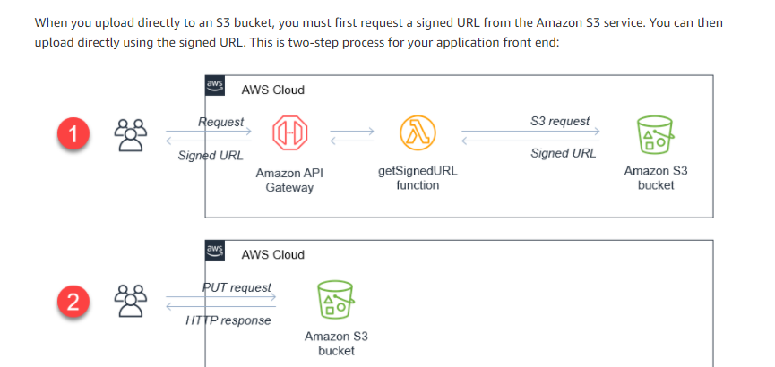

# Serverless upload to S3 
Direct and secure upload from front end to S3 built using Terraform.



Upload uses Amazon API gateway as endpoit for the API and Lambda function 
that return a pre-signed URL to the front user. This URL is used to upload
to S3
## Creating the Infrastructure:
```
terraform init
terraform validate
terraform plan -out myplan.tfplan
terraform apply "myplan.tfplan"
```
## Frontend app:
Change the "API_ENDPOINT" variable in index.html to the result URL of the Amazon API gateway.

## Destroy:
```
terraform destroy
```
PS: uploading using this serverless approach make the server releaved from upload task

PS: this is secure because no credentials are in the fontend

PS: lambda_function_payload.zip contain the "index.js" file which is the function to be exected as an AWS Lambda function.

## References:

AWS blog on direct upload: https://aws.amazon.com/blogs/compute/uploading-to-amazon-s3-directly-from-a-web-or-mobile-application/